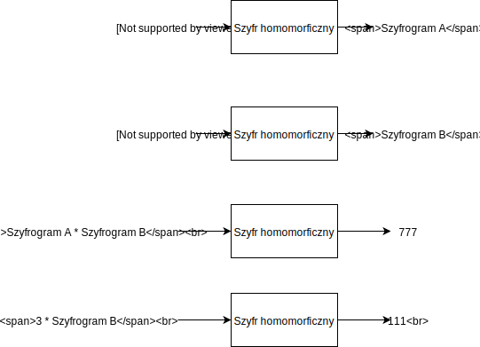
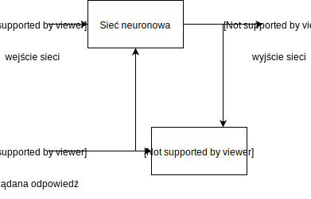

% Szyfrowanie homomorficzne w sieciach neuronowych
% Michał Zając

# Zanim zaczniemy

## W prezentacji pojawią się znaczące uproszczenia

# Wprowadzenie

## Szyfrowanie homomorficzne?

{.stretch}\ 

## Co należy pamiętać

Szyfrowanie homomorficzne pozwala na wykonywanie operacji na szyfrogramach bez konieczności ich deszyfracji.

## Sieci neuronowe

{.stretch}\ 

## Praktyczna sieć neuronowa

{.stretch}\ 

Źródło: *Going deeper with convolutions.*

## Proces uczenia sieci neuronowej

{.stretch}\ 

## Co należy pamiętać?

W sieci neuronowej "wiedzę" sieci reprezentują **wagi** między połączeniami sieci.

# Po co?

## Problem

Dane potrzebne do wytrenowania sieci neuronowej często są trudno dostępne, np. dane medyczne pacjentów, giełda papierów wartościowych itp.

## Obecnie znane rozwiązania

1. Crypto-nets.
2. Zaszyfrowanie sieci neuronowej.

## Crypto-nets

>This allows a data owner to send their data in an encrypted form to a cloud service that hosts the network.
>The encryption ensures that the data remains confidential since the cloud does not have access to the keys needed
>to decrypt it.

Źródło: *Cryptonets: Applying neural networks to encrypted data with high throughput and accuracy*

## Zalety

1. Dane są w postaci zaszyfrowanej, co powoduje, że tylko właściciel ma do nich dostęp.
2. Mamy całkowitą kontrolę nad naszą siecią neuronową.

## Wady

1. Dane nadal opuszczają swoje pierwotne miesjce - co prawda w postaci zaszyfrowanej.
2. Sieć jest bezużyteczna dla osoby nieposiadającej klucza do zaszyfrowanych danych.
3. Nie ma możliwości wyuczenia modelu z wielu różnych źródeł.

## Zaszyfrowanie sieci neuronowej

Tutaj postępujemy dokładnie odwrotnie – szyfrujemy wagi w sieci neuronowej.

## Problemy

## Nieliniowa funkcja aktywacji

Nie wszystkie funkcje matematyczne są wspierane przez schematy homomorficzne.

<aside data-markdown class="notes">
Większość schematów szyfrowania homomorficznego wspiera ograniczony zakres operacji takich jak dodawanie, odejmowanie, mnożenie czy dzielenie. Jednym z ważniejszych elementów sieci neuronowej jest funkcja aktywacji. Często jest to sigmoida, tangens hiperboliczny czy też funkcja wykładnicza. Co zrobić?
</aside>

## Wzór Taylora

Rozwinięcie funkcji w postać wielomianu z resztą w celu przybliżenia funkcji.

<aside data-markdown class="notes">
Wzór Taylora pozwala nam na przybliżenie funkcji za pomocą wielomianu zależnego od jej kolejnych pochodnych oraz pewnej reszty. Rozwiązanie takie ma oczywiście wadę - musimy przeanalizować dane wejściowe i wyliczyć dostatecznie dobre przybliżenie. Ewentualnie możemy wyliczyć bardzo dużo wyrazów sumy i mieć nadzieję że nasze przybliżenie jest wystarczająco dobre dla danych wejściowych.
</aside>

## Szyfrowanie danych

Dobór odpowiedniego schematu szyfrowania jest kluczowy.

<aside data-markdown class="notes">
Badany algorytm – EHEIV – wspiera tylko liczby całkowite co stanowi oczywisty problem w przypadku gdy dane wejściowe są zmiennoprzecinkowe. Dane oczywiście możemy pomnożyć w celu pozbycia się części przecinkowej ale jest to dodatkowy koszt obliczeniowy.
</aside>

## Zalety

1. Dane treningowe nie opuszczają komputera na którym się znajdują.
2. Sieć możemy trenować na różnych zbiorach danych poprzez deszyfrowanie i zaszyfrowanie jej nową parą kluczy tyle razy ile jest to potrzebne.
3. Z sieci może skorzystać każdy posiadający klucz publiczny ale wyjście z sieci jest możliwe do odszyfrowania tylko przez posiadacza klucza prywatnego.

## Wady

1. Testowana implementacja jest **bardzo** wolna.
2. Wybrany schemat szyfrowania jest prosty ale nie wspiera liczb zmiennoprzecinkowych.
3. Testowana sieć neuronowa jest bardzo prosta.

# Podsumowanie

## Czy to w ogóle działa?

Tak, ale bardzo wolno w porównaniu do klasycznej sieci neuronowej (kilkanaście minut vs kilka godzin na trening).

## Po co?

1. Swobodny dostęp do danych medycznych, rynkowych czy kryminalnych na potrzeby sztucznej inteligencji.
2. Ochrona danych konsumentów.
3. Kontrola nad "super sztuczną inteligencją".

## Dalsze możliwości rozwoju

1. Wybór innego schematu szyfrowania homomorficznego (Yet Another Somewhat Homomorphic Encryption wygląda na obiecującego kandydata).
2. Zaprojektowanie specjalnego schematu szyfrowania homomorficznego do zastosowania w sieciach neuronowych.
3. ~~Zestaw narzędzi pozwalający na łatwe prowadzenie badań~~ https://github.com/OpenMined.

# Źródła

##

1. https://iamtrask.github.io/2017/03/17/safe-ai/ (https://twitter.com/iamtrask)

2. MICCIANCIO, Daniele. A first glimpse of cryptography's Holy Grail. Communications of the ACM, 2010, 53.3: 96-96.

3. SZEGEDY, Christian, et al. Going deeper with convolutions.

4. XIE, Pengtao, et al. Crypto-nets: Neural networks over encrypted data. arXiv preprint arXiv:1412.6181, 2014.

##

5. GILAD-BACHRACH, Ran, et al. Cryptonets: Applying neural networks to encrypted data with high throughput and accuracy. In: International Conference on Machine Learning. 2016. p. 201-210.

6. ZHOU, Hongchao; WORNELL, Gregory. Efficient homomorphic encryption on integer vectors and its applications. In: Information Theory and Applications Workshop (ITA), 2014. IEEE, 2014. p. 1-9.

7. BOS, Joppe W., et al. Improved security for a ring-based fully homomorphic encryption scheme. In: IMA International Conference on Cryptography and Coding. Springer, Berlin, Heidelberg, 2013. p. 45-64.
